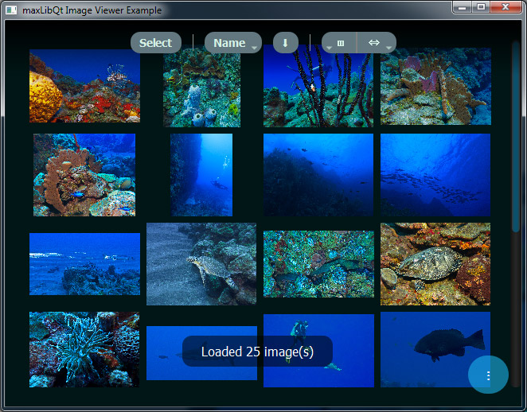
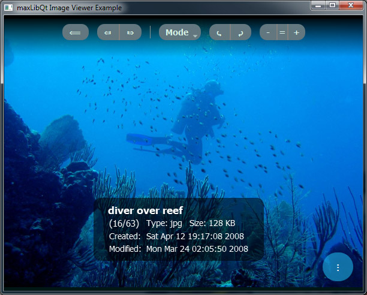
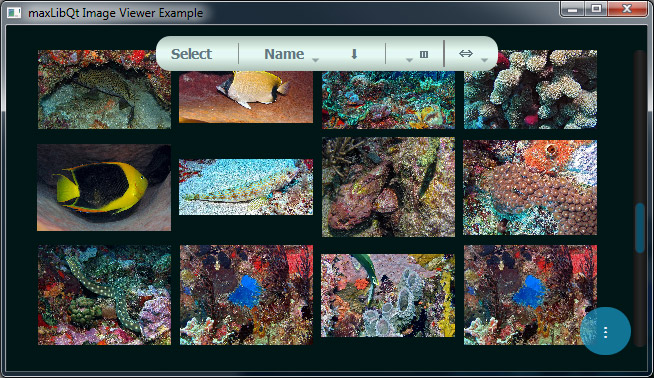
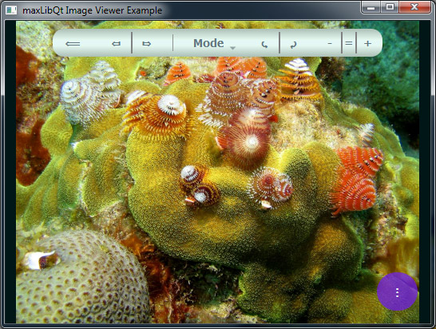
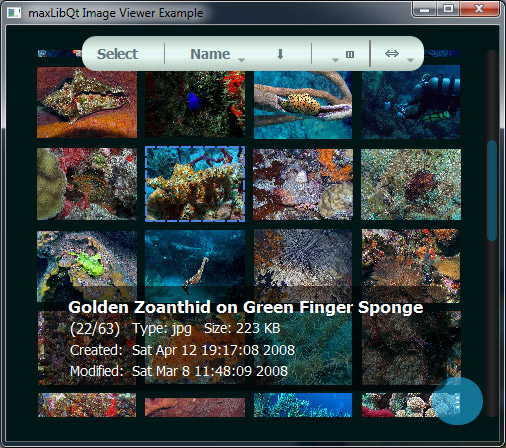
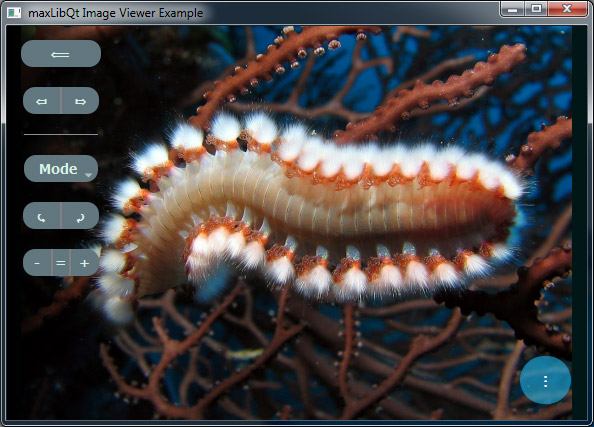

## Image Viewer Example Application ##

This is a simple but fully functional image viewer application with a "gallery view" page
and another for viewing a full size image with adjustable scaling, rotation, and zoom factors. 
This example is primarily meant to demonstrate usage of the [StackOverlayLayout][1].

[1]: https://mpaperno.github.io/maxLibQt/class_overlay_stack_layout.html#details

-------------
Copyright (c)2019 Maxim Paperno. All rights reserved.  
This example is part of the maxLibQt project and is governed by
the same licensing.

This program is distributed in the hope that it will be useful,
but WITHOUT ANY WARRANTY; without even the implied warranty of
MERCHANTABILITY or FITNESS FOR A PARTICULAR PURPOSE. 
