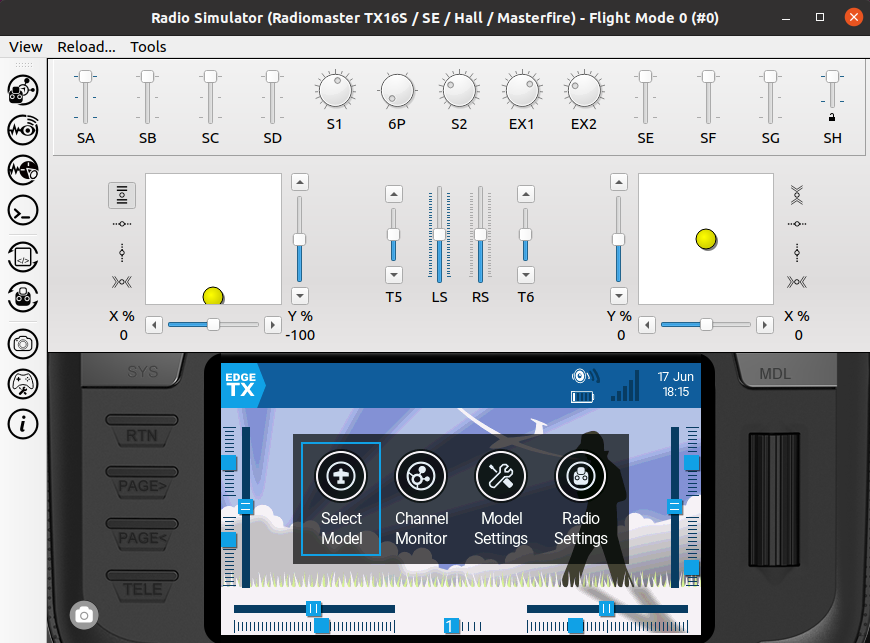

# Build Instructions under Ubuntu 24.04

Last tested with Ubuntu 24.04 LTS in March 2026.

The document here is meant to help you develop or test changes to EdgeTX on your PC, not to build flight/radio safe version of binaries.

- [Setting up the build environment for EdgeTX](#setting-up-the-build-environment-for-edgetx)
- [Building EdgeTX firmware for the radio](#building-edgetx-firmware-for-the-radio)
- [Building Companion, Simulator and radio simulator libraries](#building-companion-simulator-and-radio-simulator-libraries)

## Setting up the build environment for EdgeTX

You can setup Ubuntu 24.04 on bare-metal, inside a virtual machine environment, or using WSL2 under Windows 10/11. For WSL2 installation, please see a dedicated page about it: [Setting up Ubuntu in a Windows Subsystem for Linux](linux-wsl.md).

* Download [Ubuntu 24.04](https://ubuntu.com/download/desktop) and install it (using Minimal installation type is sufficient. Allow _Download updates while installing Ubuntu_. 3rd party software is not required, unless you need this for graphics or WiFi adapter on your PC).
* When the installer has finished and the obligatory reboot is done, log in. Install updates using Software Updater (click _Activities_ in top left corner, type in _Software Updater_ and press _Enter_). **Restart** the PC and log in again after reboot.
* To make setting up the build environment as easy as possible, we created a shell script that includes all the necessary commands. In the next steps, we download it, make it executable and run it. Active Internet connection is required for the script to be able to download the required packages for installation. Start, by opening a terminal window (click _Activities_ in the top left corner, type _terminal_ and press _Enter_). Enter the following 3 lines, each line at a time and enter your password (with sudo rights) if asked:
```
wget https://raw.githubusercontent.com/EdgeTX/edgetx/main/tools/setup_buildenv_ubuntu24.04.sh
```
```
chmod +x setup_buildenv_ubuntu24.04.sh
```
```
./setup_buildenv_ubuntu24.04.sh
```
* If all went smoothly, you should not have seen any errors, and should have been informed that setup was finished.

If you are interested to see what the script does or which functions it calls, you can open it in a text editor and have look at it - it's pretty self-explanatory (_gedit_ for example in Ubuntu is a text editor with syntax highlighting). You can alternatively start the script with _--pause_ argument to stop the script execution after each step to better inspect the output. To achieve this, issue `./setup_buildenv_ubuntu24.04.sh --pause` as the last command in the above list instead.

It's best to reboot the PC before continuing to next steps. This concludes the build setup preparations.

## Building EdgeTX firmware for the radio

For tidy files and folder hierarchy, it's best to create a dedicated subfolder in the current user home for EdgeTX, as a container for various EdgeTX flavors and builds. In the terminal window, issue the following commands, one at a time:
```
mkdir ~/edgetx
```
```
cd ~/edgetx
```

We will next fetch the EdgeTX source files from the GitHub main development branch into local subfolder /edgetx/edgetx_main in current user home, prepare the environment and build output directory. Issue, in the same terminal window as above, the following commands, one at a time:
```
git clone --recursive -b main https://github.com/EdgeTX/edgetx.git edgetx_main
```
```
cd edgetx_main && mkdir build-output
```

To build EdgeTX, we need to minimally specify the radio target, but can further select or de-select a number of build-time options. A full list of available options is documented on the [Compilation Options](compilation-options.md) page. You can also generate a text-file list of all options by running:
```
cmake -LAH -S . > ~/edgetx_main-cmake-options.txt
```

You can use, e.g. _gedit_ under Ubuntu to view the file.

As an example, we will build next for RadioMaster TX16S (PCB=X10, PCBREV=TX16S), mode 2 default stick (DEFAULT_MODE=2, will otherwise default to mode 1) and selected the type as a Debug build with debug symbols included (CMAKE_BUILD_TYPE=Debug). The CMake command for this is:
```
cmake --fresh -S . -B build-output -Wno-dev -DPCB=X10 -DPCBREV=TX16S -DDEFAULT_MODE=2 -DCMAKE_BUILD_TYPE=Debug
```
If you do not want to include the debug symbols, use `-DCMAKE_BUILD_TYPE=Release` instead.

To build for other radios, you just need to select another build target by specifying appropriate values for `PCB` and `PCBREV` for your radio. It is best to use a different build folder for each target. As a tip for which values to use, have a look at a Python script according to your radio manufacturer in a file named `build-<radio-manufacturer>.py` under [https://github.com/EdgeTX/edgetx/tree/main/tools](https://github.com/EdgeTX/edgetx/tree/main/tools)

It is recommended to set the `CMAKE_BUILD_PARALLEL_LEVEL` environment variable to the number of CPU cores on your system, to speed up all subsequent builds:
```
export CMAKE_BUILD_PARALLEL_LEVEL=$(nproc)
```

To configure, issue:
```
cmake --build build-output --target arm-none-eabi-configure
```

To build the firmware, issue:
```
cmake --build build-output --target firmware --parallel
```

This process can take some minutes to complete.
If successful, you should find a firmware binary _firmware.bin_ in the `build-output/arm-none-eabi` folder, that you can flash onto your radio.

It's a good idea to rename the binary, so that it is easier later to see the target radio and which options were baked into it. For this, issue e.g.:
```
mv build-output/arm-none-eabi/firmware.bin edgetx_main_tx16s_mode2_debug.bin
```

You will need to prepare a clean microSD card and fill it with the content according to your radio type from [https://github.com/EdgeTX/edgetx-sdcard/releases/tag/latest](https://github.com/EdgeTX/edgetx-sdcard/releases/tag/latest)

The following page lists which zip file you need: [https://github.com/EdgeTX/edgetx-sdcard](https://github.com/EdgeTX/edgetx-sdcard)

You can use [EdgeTX Buddy](https://buddy.edgetx.org/), [EdgeTX Companion](https://edgetx.org/getedgetx/), or [STM32CubeProgrammer](https://www.st.com/en/development-tools/stm32cubeprog.html) to flash the binary to your radio. For further instructions, see:
[https://manual.edgetx.org/installing-and-updating-edgetx/update-from-opentx-to-edgetx-1](https://manual.edgetx.org/installing-and-updating-edgetx/update-from-opentx-to-edgetx-1)

## Building Companion, Simulator and radio simulator libraries

### After EdgeTX 2.12

You can build firmware, the radio simulator module, Companion and Simulator all in one step:
```
cmake --build build-output --parallel --target firmware --target wasi-module --target companion --target simulator
```

This will configure and download extra dependencies as needed. Alternately, if you only want to build the simulator module at this point, you can run:
```
cmake --build build-output --parallel --target wasi-module
```

The wasm simulator module is built into `build-output/wasm/wasm-build/` but Companion looks for it in `build-output/native/`. Copy it across before launching Companion or Simulator:
```
cp build-output/wasm/wasm-build/*.wasm build-output/native/
```

If you want to build simulator modules for multiple radio targets (so they are all available in Companion), the helper script `tools/build-wasm-modules.sh` can build all supported targets in one go:
```
tools/build-wasm-modules.sh . ./wasm-modules/
```
The `.wasm` files are output to `./wasm-modules/`. Copy them to `build-output/native/` before building Companion.

Change into the `native` directory, where `<ver>` is the EdgeTX version as digits (e.g. `212` for 2.12):
```
cd build-output/native
```

To launch Companion:
```
./companion<ver>
```

Before running the simulator, copy the SD card content for your radio target from [https://github.com/EdgeTX/edgetx-sdcard/releases/tag/latest](https://github.com/EdgeTX/edgetx-sdcard/releases/tag/latest) and extract it e.g. to `~/edgetx/simu_sdcard/horus`. You should also create a radio profile first in Companion before running the simulator.

To launch the simulator:
```
./simulator<ver>
```
In the dialog that pops up, select _SD Path_ as data source and under _SD Image Path:_ browse to `~/edgetx/simu_sdcard/horus`

[](../assets/images/build/linux/EdgeTX_simulator_Linux.png)

### Legacy: EdgeTX 2.10 to 2.12

From 2.10 onwards, Companion and Simulator only incorporate hardware definitions for radio simulator libraries built before they themselves are built. You need to build a `libsimulator` for each radio target you want to include.

To include additional radio targets, re-run the `cmake --fresh` configure command from above with different `PCB` and `PCBREV` values, then build `libsimulator` again for each **before** building Companion.

Build the radio simulator library for your target, then Companion and Simulator:
```
cmake --build build-output --parallel --target libsimulator --target companion --target simulator
```
