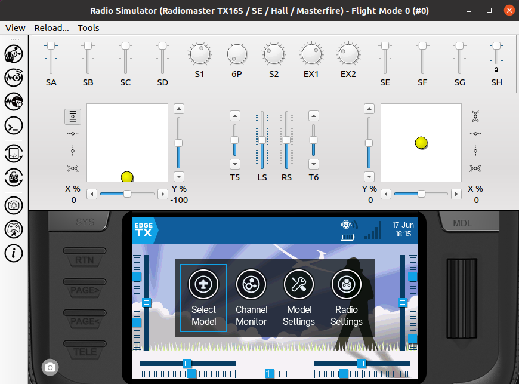

# Build & Development Instructions using Docker and Windows 10 / 11


## Download and install [Docker Desktop for Windows](https://www.docker.com/products/docker-desktop/)

## Download and install [GWSL](https://github.com/Opticos/GWSL-Source/releases/) to run Linux Companion and Simulator
- download from windows store [can use trial version it's free, please donate.]
- Run GWSL to configure it. Accept page 1 and 2 defaults and add disable access control on page 3
- GWSL will send the visual output  of the apps  in the docker coantainer to the windows desktop.

## Download and install Git [Git](https://git-scm.com/install/windows)
- Git is sourcecode controll software. It tracks changes to the source code, allows for updates, versioning, etc.

## Install Powershell for windows 
  -Right-click the Start Menu and select Terminal (Admin) or Command Prompt (Admin).
  ```
  winget install --id Microsoft.PowerShell --source winget
  ```
  - Shift + RightClick = open powershell here in the right click context menu in explorer.
  
## Fetch a local copy of the EdgeTX repository or update your existing local EdgeTX repository
```
git clone --recursive -b main https://github.com/EdgeTX/edgetx.git EdgeTX
```
- If you already have a local EdgeTX repository don't forget to update the submodules too, e.g.:
```
git fetch origin
git checkout main
git submodule update --init --recursive
```

## Run build (example TX16s)

- open a PowerShell
  - In windows explorer, open your local repository
  - Shift + RightClick, Open Powershell Here

```
docker run --name="ETXDocker" -it --rm --mount src="$(pwd)",target="/src",type=bind ghcr.io/edgetx/edgetx-dev bash
cd src
mkdir -p build-output
```
To build EdgeTX, we need to minimally specify the radio target, but can further select or de-select a number of build-time options. A full list of available options is documented on the Compilation Options page. You can also generate a text-file list of all options by running:
```
cmake -LAH -S . > ~/edgetx_main-cmake-options.txt
```
This file will be in your source directory and you can view in windows  as per normal.

As an example, we will build next for RadioMaster TX16S 
```
cmake --fresh -S . -B build-output -Wno-Author -DPCB=X10 -DPCBREV=TX16S -DDEFAULT_MODE=2 -DCMAKE_BUILD_TYPE=Release
```

If you  want to include the debug symbols, use ```-DCMAKE_BUILD_TYPE=Debug``` instead.

To build for other radios, you just need to select another build target by specifying appropriate values for ```PCB```and ```PCBREV``` for your radio. 
It is best to use a different build folder for each target. As a tip for which values to use, have a look at a Python script according to your radio manufacturer in a file named ```build-<radio-manufacturer>.py``` under https://github.com/EdgeTX/edgetx/tree/main/tools

It is recommended to set the `CMAKE_BUILD_PARALLEL_LEVEL` environment variable to the number of CPU cores on your system, to speed up all subsequent builds:
```
export CMAKE_BUILD_PARALLEL_LEVEL=$(nproc)
```

To configure, issue:
```
cmake --build build-output --target arm-none-eabi-configure
```

To build the firmware, issue:
```
cmake --build build-output --target firmware --parallel
```

This process can take some minutes to complete.
If successful, you should find a firmware binary _firmware.bin_ in the `build-output/arm-none-eabi` folder, that you can flash onto your radio.

It's a good idea to rename the binary, so that it is easier later to see the target radio and which options were baked into it. For this, issue e.g.:
```
mv build-output/arm-none-eabi/firmware.bin edgetx_main_tx16s_mode2_debug.bin
```
- The firmware is now built and in your local windows directory under ```build-output```

# More Cmake build options

X9d+:
```
-DPCB=X9D+ -DCMAKE_BUILD_TYPE=Release
```

X7:
```
-DPCB=X7 -DCMAKE_BUILD_TYPE=Release
```
TX12:
```
-DPCB=X7 -DPCBREV=TX12 -DCMAKE_BUILD_TYPE=Release
```

TX16S:
```
-DPCB=X10 -DPCBREV=TX16S -DCMAKE_BUILD_TYPE=Release
```

### Installing [flashing] firmware on radio

You will need to prepare a clean microSD card and fill it with the content according to your radio type from [https://github.com/EdgeTX/edgetx-sdcard/releases/tag/latest](https://github.com/EdgeTX/edgetx-sdcard/releases/tag/latest)

The following page lists which zip file you need: [https://github.com/EdgeTX/edgetx-sdcard](https://github.com/EdgeTX/edgetx-sdcard)

You can use [EdgeTX Buddy](https://buddy.edgetx.org/), [EdgeTX Companion](https://edgetx.org/getedgetx/), or [STM32CubeProgrammer](https://www.st.com/en/development-tools/stm32cubeprog.html) to flash the binary to your radio. For further instructions, see:
[https://manual.edgetx.org/installing-and-updating-edgetx/update-from-opentx-to-edgetx-1](https://manual.edgetx.org/installing-and-updating-edgetx/update-from-opentx-to-edgetx-1)

# Running Linux Companion and Simulator

## Building Companion, Simulator and radio simulator libraries

### After EdgeTX 2.12

You can build firmware, the radio simulator module, Companion and Simulator all in one step:
```
cmake --build build-output --parallel --target firmware --target wasi-module --target companion --target simulator
```

This will configure and download extra dependencies as needed. Alternately, if you only want to build the simulator module at this point, you can run:
```
cmake --build build-output --parallel --target wasi-module
```

The wasm simulator module is built into `build-output/wasm/wasm-build/` but Companion looks for it in `build-output/native/`. Copy it across before launching Companion or Simulator:
```
cp build-output/wasm/wasm-build/*.wasm build-output/native/
```
If you want to build simulator modules for multiple radio targets (so they are all available in Companion), the helper script `tools/build-wasm-modules.sh` can build all supported targets in one go:
```
tools/build-wasm-modules.sh . ./wasm-modules/
```
The `.wasm` files are output to `./wasm-modules/`. Copy them to `build-output/native/` before building Companion.
```
cp build-output/wasm/wasm-build/*.wasm build-output/native/
```
Change into the `native` directory, where `<ver>` is the EdgeTX version as digits (e.g. `212` for 2.12):
```
cd build-output/native
```

##To launch Companion:
- make sure GWSL is running
- get your windows ip address:
  - open a new powershell
  - in case you don't know your IP address enter ```ipconfig``` to find out
-in the previous container powershell enter

```
export DISPLAY=IP_OF_YOUR_WINDOWS_MACHINE:0.0
```
 -REMEMBER to replace your ip address
```
./companion<ver>
```

Before running the simulator, copy the SD card content for your radio target from [https://github.com/EdgeTX/edgetx-sdcard/releases/tag/latest](https://github.com/EdgeTX/edgetx-sdcard/releases/tag/latest) and extract it e.g. to `~/edgetx/simu_sdcard/horus`. You should also create a radio profile first in Companion before running the simulator.


## Running Companion after a build and Container restart

- make sure GWSL is running
- open ```powershell```
```
  docker run --name="ETXDocker" -it --rm --mount src="$(pwd)",target="/src",type=bind ghcr.io/edgetx/edgetx-dev bash
  export DISPLAY=IP_OF_YOUR_WINDOWS_MACHINE:0.0
  cd src
  ./companion<ver>
```

Before running the simulator, copy the SD card content for your radio target from [https://github.com/EdgeTX/edgetx-sdcard/releases/tag/latest](https://github.com/EdgeTX/edgetx-sdcard/releases/tag/latest) and extract it e.g. to `~/edgetx/simu_sdcard/horus`. You should also create a radio profile first in Companion before running the simulator.

## To launch the simulator:
-the process is the same as companion
```
./simulator<ver>
```
In the dialog that pops up, select _SD Path_ as data source and under _SD Image Path:_ browse to `~/edgetx/simu_sdcard/horus`

[](../assets/images/build/linux/EdgeTX_simulator_Linux.png)

### Legacy: EdgeTX 2.10 to 2.12

From 2.10 onwards, Companion and Simulator only incorporate hardware definitions for radio simulator libraries built before they themselves are built. You need to build a `libsimulator` for each radio target you want to include.

To include additional radio targets, re-run the `cmake --fresh` configure command from above with different `PCB` and `PCBREV` values, then build `libsimulator` again for each **before** building Companion.

Build the radio simulator library for your target, then Companion and Simulator:
```
cmake --build build-output --parallel --target libsimulator --target companion --target simulator
```


# Needful things

- Should you get a message like ```container name "/ETXDocker" is already in use``` open a PowerShell and enter ```docker stop ETXDocker```
- If you need to update the docker image open a PowerShell and enter: ``` docker rmi ghcr.io/edgetx/edgetx-dev```. The latest image will then be downloaded at next docker run
- before running the simulator you need to run companion and create a radio profile
- companion and simulator won't have audio. If you need audio you might find [PulseAudio on WSL2](https://www.linuxuprising.com/2021/03/how-to-get-sound-pulseaudio-to-work-on.html) useful

# References

see [EdgeTX Build repository](https://github.com/EdgeTX/build-edgetx)
