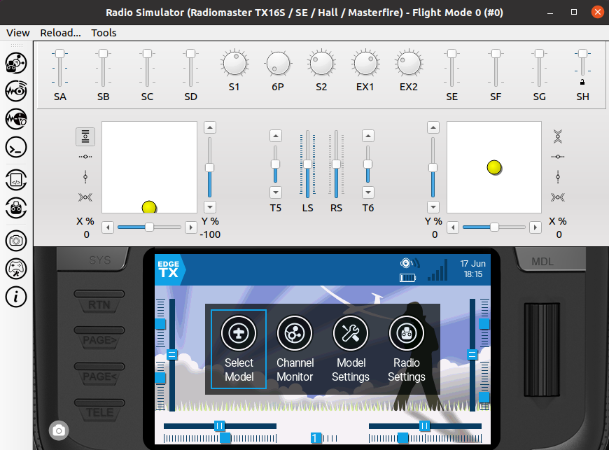

# Build Instructions using Docker and Windows 10 / 11

## Setting up the build environment

This guide runs Docker Engine inside WSL 2 (Windows Subsystem for Linux), and all build commands are run from a WSL (Ubuntu) terminal. This is done in order to not have extra software running all the time when you do not need it. If you would rather use Docker Desktop or Podman Desktop, see [Alternative: Docker Desktop or Podman Desktop](#alternative-docker-desktop-or-podman-desktop) below.

### WSL 2 and Ubuntu

Click Start, type **cmd**, right-click **Command Prompt** and choose **Run as administrator**, then run:
```bat
wsl --install -d Ubuntu
```
Ubuntu will usually carry on installing straight away and ask you to create your Linux user name and password. These are only used inside this Ubuntu installation and don't need to match your Windows account. You will need the password whenever you run a command with `sudo`, such as when installing software later in this guide.

If you are asked to reboot, do so, then open Ubuntu to finish the setup. To open the Ubuntu terminal later, choose **Ubuntu** from the Start Menu, open a new Ubuntu tab in Windows Terminal, or run `wsl` from a Command Prompt or PowerShell.

If you already have WSL installed, run `wsl --update` to make sure it is up to date.

`wsl --install` enables the Windows features WSL needs for you. If it fails, or you are on an older Windows 10 build, see Microsoft's [Install WSL](https://learn.microsoft.com/en-us/windows/wsl/install) guide and the [manual installation steps](https://learn.microsoft.com/en-us/windows/wsl/install-manual). Hardware virtualization must also be enabled in your PC's BIOS/UEFI settings. It usually is by default, but if WSL reports an error about virtualization, check there first.

To run the Linux Companion and Simulator, this guide uses [WSLg](https://github.com/microsoft/wslg), which is built into WSL 2 on Windows 11, and on Windows 10 (21H2 or later) when WSL is installed from the Microsoft Store. No separate X server is needed.

### Docker Engine

In the Ubuntu terminal, install Docker Engine from Ubuntu's package repository:
```bash
sudo apt update && sudo apt install -y docker.io
```
If you would rather have the very latest version of Docker Engine, you can instead follow Docker's own [Docker Engine install guide for Ubuntu](https://docs.docker.com/engine/install/ubuntu/). Either will work for this guide.

Then allow your user to run `docker` without `sudo`:
```bash
sudo usermod -aG docker $USER
```
Close and re-open the Ubuntu terminal for this to take effect. Then check Docker is working with:
```bash
docker run hello-world
```
The first time you run this, Docker will report that it is `Unable to find image 'hello-world:latest' locally`, and then download it. This is expected. It then runs the container, which prints `Hello from Docker!` followed by `This message shows that your installation appears to be working correctly.` If you get a `permission denied` error instead, the group change above has not taken effect yet. Close all Ubuntu terminals, run `wsl --shutdown` from a Command Prompt, and try again.

!!! tip "Cannot connect to the Docker daemon?"
    The Docker service is started by systemd, which is enabled by default in current Ubuntu WSL installs. If `docker` reports that it cannot connect to the Docker daemon, check that `/etc/wsl.conf` contains:
    ```ini
    [boot]
    systemd=true
    ```
    then run `wsl --shutdown` from a Windows Command Prompt and re-open Ubuntu.

### Git

[Git](https://git-scm.com/) is source code control software used to download the EdgeTX source code and keep it up to date. Install it in the Ubuntu terminal with:
```bash
sudo apt update && sudo apt install -y git
```

## Getting the EdgeTX source code

In the Ubuntu terminal, clone the source code repository into your Linux home directory:
```bash
cd ~
git clone --recursive -b main https://github.com/EdgeTX/edgetx.git edgetx
```
This gets the latest development code on the `main` branch. If you want to build a specific release series instead, use its branch name in place of `main` here and in the update commands below, e.g. `-b 2.12`.

Keep the repository in the WSL file system (e.g. `~/edgetx`) rather than on a Windows drive under `/mnt/c/...`, as builds are much slower when working across the Windows/WSL boundary. You can still browse the files from Windows at `\\wsl$\Ubuntu\home\<your user name>\edgetx`, or by running `explorer.exe .` from the repository folder.

If you already have a local copy, update it to the latest version of the branch you are building, including the submodules:
```bash
cd ~/edgetx
git checkout main
git pull
git submodule update --init --recursive
```

## Start the build container

Start the EdgeTX build container from your local repository, using the command for the container runtime you installed:

=== "Docker Engine (WSL)"

    In the Ubuntu terminal:
    ```bash
    cd ~/edgetx
    docker run --name="ETXDocker" -it --rm \
      --mount src="$(pwd)",target="/src",type=bind \
      -w /src \
      -v /mnt/wslg/.X11-unix:/tmp/.X11-unix \
      -v /mnt/wslg:/mnt/wslg \
      -e DISPLAY=:0 \
      -e WAYLAND_DISPLAY=wayland-0 \
      -e XDG_RUNTIME_DIR=/mnt/wslg/runtime-dir \
      -e PULSE_SERVER=/mnt/wslg/PulseServer \
      -e CMAKE_BUILD_PARALLEL_LEVEL=$(nproc) \
      ghcr.io/edgetx/edgetx-dev bash
    ```

=== "Docker Desktop"

    In PowerShell, from your local repository folder:
    ```powershell
    docker run --name="ETXDocker" -it --rm `
      --mount src="$(pwd)",target="/src",type=bind `
      -w /src `
      -v /run/desktop/mnt/host/wslg/.X11-unix:/tmp/.X11-unix `
      -v /run/desktop/mnt/host/wslg:/mnt/wslg `
      -e DISPLAY=:0 `
      -e WAYLAND_DISPLAY=wayland-0 `
      -e XDG_RUNTIME_DIR=/mnt/wslg/runtime-dir `
      -e PULSE_SERVER=/mnt/wslg/PulseServer `
      -e CMAKE_BUILD_PARALLEL_LEVEL=$env:NUMBER_OF_PROCESSORS `
      ghcr.io/edgetx/edgetx-dev bash
    ```

=== "Podman Desktop"

    In PowerShell, from your local repository folder:
    ```powershell
    podman run --name="ETXDocker" -it --rm `
      --mount src="$(pwd)",target="/src",type=bind `
      -w /src `
      -v /mnt/wslg/.X11-unix:/tmp/.X11-unix `
      -v /mnt/wslg:/mnt/wslg `
      -e DISPLAY=:0 `
      -e WAYLAND_DISPLAY=wayland-0 `
      -e XDG_RUNTIME_DIR=/mnt/wslg/runtime-dir `
      -e PULSE_SERVER=/mnt/wslg/PulseServer `
      -e CMAKE_BUILD_PARALLEL_LEVEL=$env:NUMBER_OF_PROCESSORS `
      ghcr.io/edgetx/edgetx-dev bash
    ```

You should now be in a shell inside the container, with a prompt that looks a little like `root@8c2f137e0944:/src#`. Your local repository is available in the container at `/src` (set by the `--mount` option), and the shell starts in that folder (set by `-w /src`).

The `-v` options and the `DISPLAY`, `WAYLAND_DISPLAY`, `XDG_RUNTIME_DIR` and `PULSE_SERVER` settings give the container access to WSLg, so that Companion and Simulator can open windows on your Windows desktop and play sound.

`CMAKE_BUILD_PARALLEL_LEVEL` sets how many compile jobs run at once to the number of CPU cores on your system. This speeds up builds, and also stops the `--parallel` build commands used in this guide from starting an unlimited number of jobs, which can use up all available memory and cause the build, or even the whole system, to lock up.

!!! tip "Only building firmware?"
    If you don't need to run Companion or Simulator, you can leave out the WSLg options:
    ```bash
    docker run --name="ETXDocker" -it --rm --mount src="$(pwd)",target="/src",type=bind -w /src -e CMAKE_BUILD_PARALLEL_LEVEL=$(nproc) ghcr.io/edgetx/edgetx-dev bash
    ```
    If you are using Docker Desktop or Podman Desktop, use `podman` instead of `docker` for Podman, and `$env:NUMBER_OF_PROCESSORS` instead of `$(nproc)` in PowerShell.

!!! note "Building an older release?"
    The commands above use the latest build container image, which matches the `main` branch. If you are building a release branch, use the image tag for that release by adding it to the end of the image name, e.g. `ghcr.io/edgetx/edgetx-dev:2.12` or `ghcr.io/edgetx/edgetx-dev:2.11` (for 2.10, use `:2.10.0`). Older releases need older build tools (e.g. EdgeTX 2.10 and 2.11 use Qt 5), so they may not build with the latest image.

!!! tip "Start the container with a single command"
    To avoid typing the full `docker run` command each time, you can add it to your Ubuntu shell as a command called `etx-docker`. Run this once in the Ubuntu terminal:
    ```bash
    cat >> ~/.bashrc << 'EOF'

    # Start the EdgeTX build container in the current folder
    # Usage: etx-docker [image tag], e.g. etx-docker or etx-docker 2.12
    etx-docker() {
      docker run --name="ETXDocker" -it --rm \
        --mount src="$(pwd)",target="/src",type=bind \
        -w /src \
        -v /mnt/wslg/.X11-unix:/tmp/.X11-unix \
        -v /mnt/wslg:/mnt/wslg \
        -e DISPLAY=:0 \
        -e WAYLAND_DISPLAY=wayland-0 \
        -e XDG_RUNTIME_DIR=/mnt/wslg/runtime-dir \
        -e PULSE_SERVER=/mnt/wslg/PulseServer \
        -e CMAKE_BUILD_PARALLEL_LEVEL=$(nproc) \
        ghcr.io/edgetx/edgetx-dev:"${1:-latest}" bash
    }
    EOF
    source ~/.bashrc
    ```
    From then on, start the container with:
    ```bash
    cd ~/edgetx
    etx-docker
    ```
    To use the image for an older release, add its tag, e.g. `etx-docker 2.12`.

## Building the firmware

Building the firmware is done in two steps: first you **configure** the build, choosing which radio to build for and any build options, then you **build** it.

Run the following commands in the container, from the `/src` folder it starts in.

### Configure

To configure the build, you need to at least specify the radio target, and can also select or de-select a number of build-time options. A full list of available options is documented on the [Compilation Options](compilation-options.md) page.

As an example, to configure a build for the RadioMaster TX16S in the `build-output` folder:
```bash
cmake --fresh -S . -B build-output -Wno-dev -DPCB=X10 -DPCBREV=TX16S -DCMAKE_BUILD_TYPE=Release
```

If you want to include the debug symbols, use `-DCMAKE_BUILD_TYPE=Debug` instead.

To build for other radios, you just need to specify the appropriate values for `PCB` and `PCBREV` for your radio. It is best to use a different build folder for each radio.

!!! tip "Which `PCB` and `PCBREV` values should I use?"
    [`tools/build-common.sh`](https://github.com/EdgeTX/edgetx/blob/main/tools/build-common.sh) lists the CMake options for every supported radio. Search it for your radio's name (e.g. `tx16s`) to find the matching `-DPCB` and `-DPCBREV` values.

    Alternatively, the repository includes CMake presets for all supported radios, so you can configure with just the radio name, e.g. `cmake --preset tx16s`. Run `cmake --list-presets` to see them all, and see [Building EdgeTX](index.md#quick-start-with-cmake-presets) for more details.

### Build firmware

To build the firmware, issue:
```bash
cmake --build build-output --target firmware --parallel
```

This process can take some minutes to complete.
If successful, you should find a firmware binary _firmware.bin_ in the `build-output/arm-none-eabi` folder, that you can flash onto your radio.

!!! note "UF2 firmware"
    Some newer radios, such as those based on the STM32H7 (e.g. RadioMaster TX16S MK3, TX15 and GX15, and Jumper T15 Pro), also produce a _firmware.uf2_ file in the same folder. For these radios, use the `.uf2` file instead of the `.bin` file.

It's a good idea to rename the firmware file, so that it is easier later to see the target radio and which options were baked into it. For this, issue e.g.:
```bash
mv build-output/arm-none-eabi/firmware.bin build-output/edgetx_main_tx16s_mode2_release.bin
```
(use `firmware.uf2` and a `.uf2` extension instead if your radio uses UF2 firmware)

The firmware is now built and in your local repository under `build-output`. From Windows, you can find it at `\\wsl$\Ubuntu\home\<your user name>\edgetx\build-output`.

!!! tip "Listing all build options"
    Once the firmware has been built, you can save a list of all the build options available for your radio, and their current values, to a text file in your repository:
    ```bash
    cmake -LAH -N build-output/arm-none-eabi > edgetx-cmake-options.txt
    ```

### Flashing the firmware to your radio

Before flashing, make sure your radio's SD card has the matching SD card content. See the [EdgeTX SD card repository](https://github.com/EdgeTX/edgetx-sdcard) for which zip file your radio needs, and download it from the [latest release](https://github.com/EdgeTX/edgetx-sdcard/releases/tag/latest).

You can use [EdgeTX Buddy](https://buddy.edgetx.org/), [EdgeTX Companion](https://edgetx.org/getedgetx/), or [STM32CubeProgrammer](https://www.st.com/en/development-tools/stm32cubeprog.html) to flash the firmware to your radio. For step-by-step instructions, see [Installing and Updating EdgeTX](https://manual.edgetx.org/installing-and-updating-edgetx) in the EdgeTX manual. STM32H7-based radios (those using `.uf2` firmware) have their own [update process](https://manual.edgetx.org/installing-and-updating-edgetx/updating-your-stm32h7-radio).

## Build Companion and Simulator

### EdgeTX 3.0 and later (`main` branch)

You can build the radio simulator library, Companion and Simulator all in one step:
```bash
cmake --build build-output --parallel --target wasi-module --target companion --target simulator
```

This will configure and download extra dependencies as needed. Alternately, if you only want to build the simulator module at this point, you can run:
```bash
cmake --build build-output --parallel --target wasi-module
```

The WASM simulator module is built into `build-output/wasm/wasm-build/` but Companion looks for it in `build-output/native/`. Copy it across before launching Companion or Simulator:
```bash
cp /src/build-output/wasm/wasm-build/*.wasm /src/build-output/native/
```

If you want to build simulator modules for multiple radio targets (so they are all available in Companion), the helper script `tools/build-wasm-modules.sh` can build all supported targets in one go:
```bash
tools/build-wasm-modules.sh . wasm-modules
```

To build only some radios, list them in the `FLAVOR` environment variable, separated by semicolons. The quotes are required. The radio names are the same ones used in `tools/build-common.sh`:
```bash
FLAVOR="tx16s;tx16smk3;gx12" tools/build-wasm-modules.sh . wasm-modules
```

The script's two arguments are the source folder (`.` for the current folder) and the folder to put the `.wasm` files in.

Copy the `.wasm` files to `build-output/native/` before launching Companion:
```bash
cp /src/wasm-modules/*.wasm /src/build-output/native/
```

### Legacy: EdgeTX 2.10 to 2.12

In EdgeTX 2.10 to 2.12, each radio you want to use in Companion and Simulator needs its own radio simulator library (`libsimulator`). Companion only includes the radios whose simulator libraries were already built when Companion itself was built, so always build the simulator libraries **first**, then Companion and Simulator.

#### Single radio

For a single radio, configure the build for that radio as described in [Configure](#configure), then build the simulator library, Companion and Simulator in one step:
```bash
cmake --build build-output --parallel --target libsimulator --target companion --target simulator
```

#### Multiple radios

To include more than one radio, configure and build the simulator library for each radio in turn, using the same build folder, and then build Companion and Simulator once at the end. For example, for the Jumper T20 and T15:
```bash
# Jumper T20
rm -f build-output/native/CMakeCache.txt
cmake --fresh -S . -B build-output -Wno-dev -DPCB=X7 -DPCBREV=T20 -DCMAKE_BUILD_TYPE=Release
cmake --build build-output --parallel --target libsimulator

# Jumper T15
rm -f build-output/native/CMakeCache.txt
cmake --fresh -S . -B build-output -Wno-dev -DPCB=X10 -DPCBREV=T15 -DCMAKE_BUILD_TYPE=Release
cmake --build build-output --parallel --target libsimulator

# Companion and Simulator, including both radios
cmake --build build-output --parallel --target companion --target simulator
```
Removing `build-output/native/CMakeCache.txt` before each configure makes sure no build options are carried over from the previous radio. The simulator libraries already built are kept, so each radio adds to the list.

!!! note "Adding radios later"
    Companion only picks up the list of radios when it is first built. If you have already built Companion and want to add another radio, build its simulator library as above, then delete `build-output/native/companion/src/hwdefs.qrc` before building Companion and Simulator again. Alternatively, start again with a new build folder.

## Launching Companion

In the container, change into the `native` directory and run Companion, where `<ver>` is the EdgeTX version as digits (e.g. `30` for 3.0, or `212` for 2.12):
```bash
cd /src/build-output/native
./companion<ver>
```
The Companion window will open on your Windows desktop via WSLg. Before running the simulator, create a radio profile in Companion for the radio you want to simulate.

!!! tip "Keep your Companion settings between sessions"
    Companion saves its settings, including your radio profiles, in `/root/.config/EdgeTX` inside the container, which is deleted when the container exits. To keep them, create a folder for them in the Ubuntu terminal:
    ```bash
    mkdir -p ~/.config/EdgeTX-docker
    ```
    and add this line to the `docker run` command (before the image name):
    ```bash
      -v ~/.config/EdgeTX-docker:/root/.config/EdgeTX \
    ```
    In PowerShell (Docker Desktop or Podman Desktop), run `mkdir "$env:APPDATA\EdgeTX-docker"` once, and add `` -v "$env:APPDATA\EdgeTX-docker:/root/.config/EdgeTX" ` `` instead.

## Launching the Simulator

The simulator needs the SD card content for your radio. Download the matching zip from [EdgeTX SD card releases](https://github.com/EdgeTX/edgetx-sdcard/releases/tag/latest) and extract it into your local repository, e.g. to `~/edgetx/simu_sdcard/horus` in the Ubuntu terminal. Inside the container, this is `/src/simu_sdcard/horus`.

!!! note
    Keep the SD card content inside your local repository. The container's own file system (including its home directory `~`) is deleted each time the container exits.

From the same `native` directory, run:
```bash
./simulator<ver>
```
In the dialog that pops up, select _SD Path_ as data source and under _SD Image Path:_ browse to `/src/simu_sdcard/horus`.

[](../assets/images/build/linux/EdgeTX_simulator_Linux.png)

## Running Companion or the Simulator again later

You don't need to rebuild each time. Start the container as described in [Start the build container](#start-the-build-container), then launch Companion or the Simulator as above.

## Troubleshooting

- Should you get a message like `container name "/ETXDocker" is already in use`, open another Ubuntu terminal and enter `docker stop ETXDocker`
- If the build fails after updating your repository, or the build tools seem out of date, update the build container image by opening an Ubuntu terminal and entering `docker pull ghcr.io/edgetx/edgetx-dev`
- If builds fail with errors about running out of memory (e.g. `Killed` or `internal compiler error`), or the build or your PC locks up, reduce the number of compile jobs. By default, WSL can only use half of your PC's memory, which may not be enough to run one job per CPU core. In the container, run e.g. `export CMAKE_BUILD_PARALLEL_LEVEL=4` before building, and try a lower number if it still fails.
- If Companion or Simulator fail with an error like `could not connect to display`, check that WSLg is working by running `wsl --update` and then `wsl --shutdown` from a Windows Command Prompt, re-opening Ubuntu, and making sure you started the container with the WSLg `-v` and `-e` options shown above.

## Alternative: Docker Desktop or Podman Desktop

Instead of installing Docker Engine inside WSL, you can use a Windows desktop application to run the container. Either of the following will work:

- [Docker Desktop for Windows](https://www.docker.com/products/docker-desktop/) (free for personal use, education and small businesses; check the license terms if using it at work)
- [Podman Desktop](https://podman-desktop.io/) (free and open source)

Both use WSL 2 under the hood, and the installer will normally enable it for you. With these, the steps above change as follows:

- Commands are run from PowerShell instead of the Ubuntu terminal. Tip: Shift + right-click in a folder in File Explorer to get an "Open PowerShell window here" option in the context menu.
- Install [Git for Windows](https://git-scm.com/install/windows) (or run `winget install --id Git.Git --source winget`), and clone the repository to a folder on your Windows drive.
- Your repository, build output and firmware files are in that Windows folder, so you can ignore the `\\wsl$\Ubuntu\...` paths mentioned above. The SD card content for the simulator also goes in that folder, and is still available at `/src/...` inside the container.
- If you are using Podman, replace `docker` with `podman` in each command.
- To start the container, use the **Docker Desktop** or **Podman Desktop** tab in [Start the build container](#start-the-build-container).
- If you cannot use WSLg (e.g. an older Windows 10 build), you can use an X server such as [GWSL](https://github.com/Opticos/GWSL-Source/releases/) instead. Install and run it, disable access control during its setup, then leave out the WSLg `-v` and `-e` options when starting the container, and in the container run `export DISPLAY=<your Windows IP address>:0.0` (find your IP with `ipconfig`) before launching Companion or Simulator. Audio will not work in this setup.

## References

- [Building EdgeTX](index.md): overview of building EdgeTX on all platforms, including CMake presets and build options
- [EdgeTX build-edgetx repository](https://github.com/EdgeTX/build-edgetx): source of the `edgetx-dev` build container image used in this guide

*[WASM]: WebAssembly
*[WSL]: Windows Subsystem for Linux
*[WSLg]: Windows Subsystem for Linux GUI
*[UF2]: USB Flashing Format
