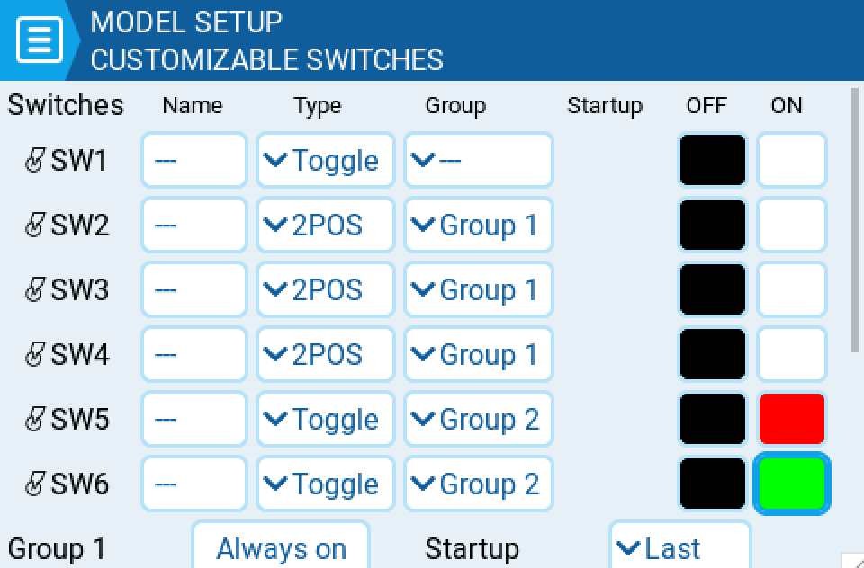

# Customisable Switches

The functions switches are a type of multipos switches that are managed directly by EdgeTX. Physically, they look a bit like a regular 6pos switch, but they are much more flexible.

Unlike other switches that are manage at radio level, functions switches are defined per model, and are therefore set in model setup page.

## Switch type

Function switch can be set to:

`none` : they are basically disabled

`toggle` : they are active only during push duration

`2POS` : pushing the switch will alternate state : OFF push ON push OFF ....

## Switch group

A traditional 6POS is basically a group of 6 switches that work together, where only one can be active at one time. Functions switches expand that concept and let you choose how FS should be grouped.

`-` defines a function switch with no group. Pushing it will only affect this switch

`1`, `2` or `3` define groups. All the switches in a group act together, **where only one (the last pushed) can be active**

**Always on groups** : in hardware 6POS implementations, one switch of the group MUST stay on, in other words, the switches in the group cannot be all off. If you want this type of behavior, you should tick the check box at the right side of the screen.

In a traditional 6POS , all the switches belong to the same group. If you want 2 groups of 3 switches, assign 3 switches to group 1, and 3 to group 2

## Startup Position

For switch not in group, you can defined in what state each switches will be when the model is loaded

`↑` switch is inactive

`↓` switch is active

`=` switch is set to the same state is was when the model was last used (it keeps old state)

For groups

`=` all switches in group are set to the same state is was when the model was last used (it keeps old state)

`SWx` SWx is set to on, the others in groups are set to off

`OFF` all switches are set to off at start (NOT available when group is set to 'always on')
