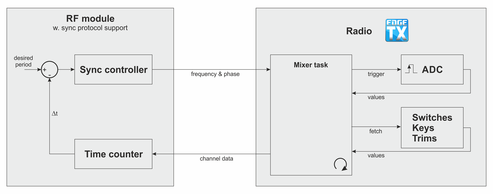

# Mixer Synchronisation

The EdgeTX mixer can be synchronised with some modules.

Here is a short list of synchronised modules/protocols:
- any module using `CRSF` (Crossfire, Tracer, ExpressLRS)
- `GHST`
- `MPM`
- PXX1 / PXX2 (based on FrSky's heartbeat mechanism)

## Mixer task

The mixer task is responsible for mainly 3 things:
- trigger the ADC conversions
- compute channel values
- send the channels to the module(s)

## Mixer scheduler

The mixer task is triggered cycle-by-cycle with the help of a scheduler controlled by a timer. This timer is either set to a fixed (non-synchronised modules) or an adjustable value.

Synchronised modules are able to adjust the value of this timer by implementing a regulation loop that allows to optimise the timing for some metrics. Most of the time the module wants to optimise the latency. At the same time, it allows to prevent sampling aliasing caused by the ADC sample frequency being different from the frequency at which channels are sent over the air (historical reason for implementing the mixer scheduler in the first place).

If we look at the regulation loop, there are indeed two parameters that you want to be able to set:
- frequency
- phase

The mixer scheduler will take these two parameters as input to set the timer for the next cycle and try to adjust accordingly.

## Regulation loop

The synchronisation mechanism can be seen as a classical regulation loop. The set point in this regulation loop is the mixer scheduler timer. The feedback is given by the module to directly adjust the set point. Please note that the regulation is actually living in the module: this means that the module is responsible for adjusting the set point according to its needs (in most cases, minimising latency).

## Heartbeat mechanism

FrSky implements the synchronisation in a different way, so the mixer scheduler is by-passed. When a heartbeat is detected, the mixer is triggered and the safety timer is reset.
