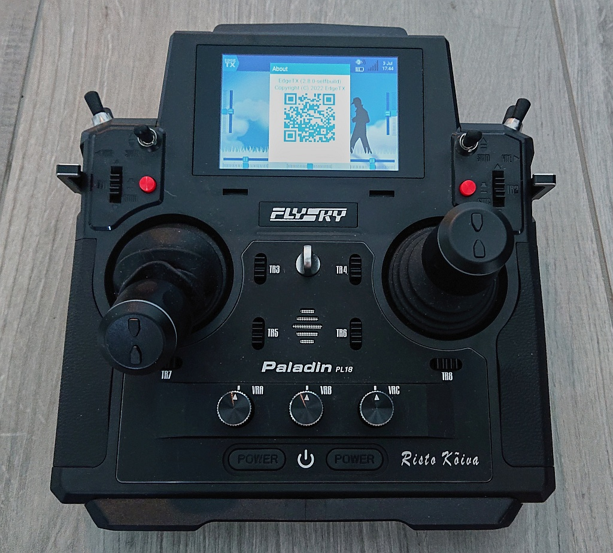
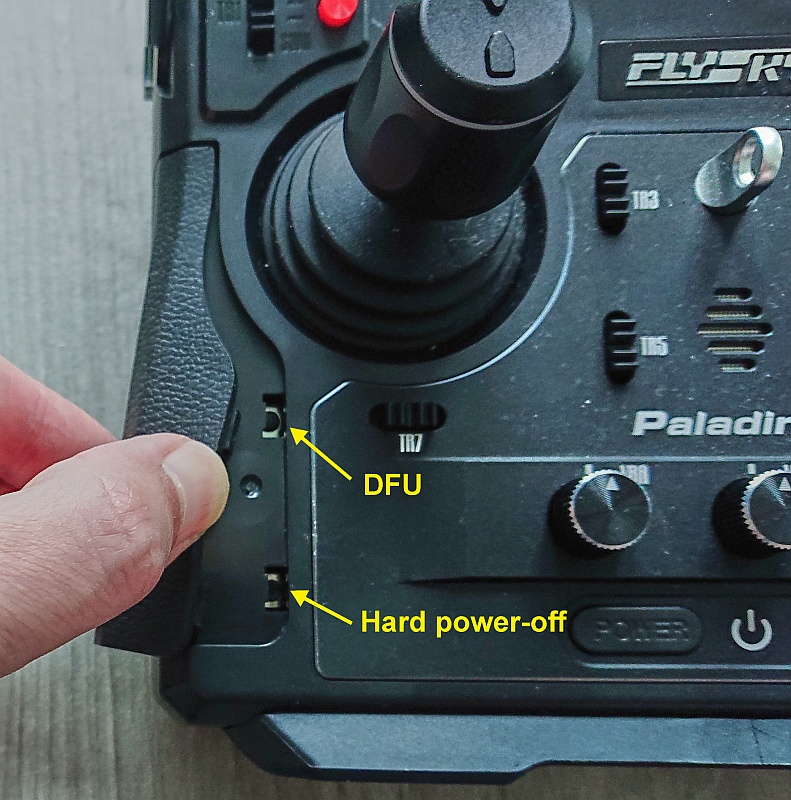
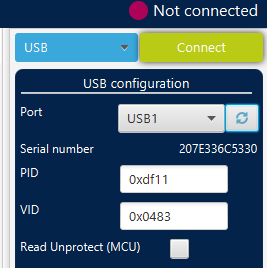
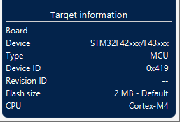
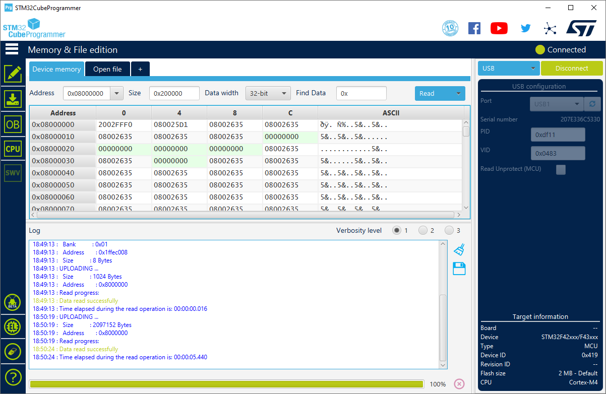
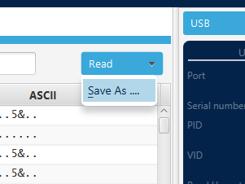
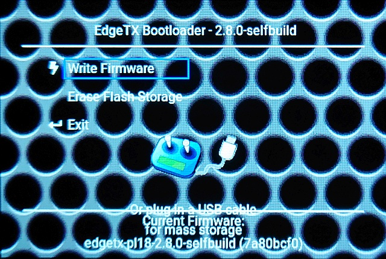
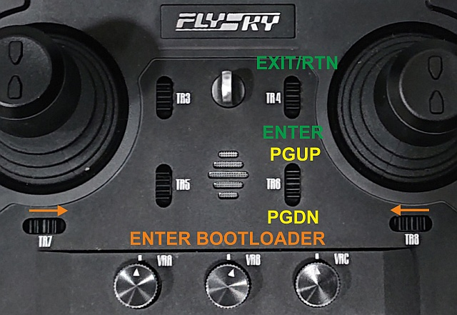

# Flashing EdgeTX to Flysky PL18 or Paladin EV

This page lists the recommended steps to install EdgeTX onto Flysky PL18 or Paladin EV radios.

- [Preparatory steps](#preparatory-steps)
- [Backing up Flysky Bootloader](#backing-up-flysky-bootloader)
- [Flashing EdgeTX bootloader and firmware](#flashing-edgetx-bootloader-and-firmware)
- [Preparing internal SPI flash](#preparing-internal-spi-flash)
- [External RF module support](#external-rf-module-support)

***

Please keep in mind that at present day, EdgeTX support for Flysky PL18 and Paladin EV radios is still in development - the upcoming v2.10 is scheduled to provide the first release. Use EdgeTX on PL18 or Paladin EV for testing purposes only at the moment. A lot of EdgeTX functionality is already successfully implemented for PL18 / Paladin EV, but not all.

Due to PL18 and Paladin EV radio hardware differences, when compared to other EdgeTX supported radios, full EdgeTX experience, as known from other supported color screen radios, will not be possible with PL18 and Paladin EV, at least not without some hardware modifications. Factory PL18 and Paladin EV do not have a real-time-clock, an arbitrary sound output and an expandable storage, latter due to lack of a microSD card slot. PL18 and Paladin EV come with internal 8 MB SPI flash chip, where from factory, part of Flysky PL18 or Paladin EV firmware is stored. EdgeTX uses this memory chip as a microSD card substitute. Due to limited size of 8 MB, full EdgeTX SD card contents does not although fit into the internal memory. As arbitrary sound output is not possible anyhow, you can skip copying the chunky `\SOUNDS` SD card subfolder.

**If you ever want to restore the original Flysky firmware to your PL18 or Paladin EV at a later date, it is crucial that you follow successfully the _Backing up Flysky Bootloader_ section.** As only, if the Flysky bootloader is restored to the radio, you can use Flysky Assistant Windows software to fully restore also the SPI flash content via Flysky online servers.

## Preparatory steps

* Remove the FRM301 RF-module for now. This module likely will never get official EdgeTX support due to proprietary API that Flysky desires to keep confidential. You can use [Flysky FJR2 JR-micro bay adapter](https://www.flysky-cn.com/b1700-specifications) to attach arbitrary JR micro bay RF-modules to the PL18 or Paladin EV instead. Alternatively, consider ExpressLRS firmware for the FRM301 (see [ExpressLRS pull-request #1811](https://github.com/ExpressLRS/ExpressLRS/pull/1811)) or see the section about supported [external RF modules](#external-rf-module-support) below.
* Fully charge the battery of your PL18 or Paladin EV before starting with the backup or the flashing steps below.
* Download and install the latest STM32CubeProgrammer, see for instructions: [Unbrick your radio](unbrick.md) (you need to make an account at ST to be able to download it).
* Peel off the left rubber handle on your PL18 or Paladin EV. That should reveal two hidden buttons. The top button is the Device-Firmware-Upgrade (DFU) button, the bottom button is the ultimate master power-off button and will be required to be pressed to exit the DFU mode.

## Backing up Flysky Bootloader

**This step is crucial, if you ever wish to return/restore back to Flysky factory firmware on your PL18 or Paladin EV.**

* Make sure your PL18 / Paladin EV radio is powered off. Grab and attach a microUSB cable on the radio side only for now. Put the radio flat on the table. Next, press and hold the upper hidden button (DFU) down, while you attach the other end of the USB cable into the computer, where you previously installed the STM32CubeProgrammer software. This connects your PL18 / Paladin EV to your computer in DFU mode.
* You should have heard the typical sound from your computer, when you attach an USB device. Start STM32CubeProgrammer software.
* The STM32F429BIT6 microcontroller in the PL18/PL18EV should have been detected on the right side of the STM32CubeProgrammer screen under USB configuration as a USB with a number, typically USB1. Open the drop-down menu next to `Port` to check if you see USB1 listed there and then select it. Click the green `Connect` button on top right.

* You might be greeted with some seemingly random content, do not get alarmed - this is all perfectly fine and just showing some of the first bytes of memory that are currently saved on the microcontroller. Most importantly, check that the lower right corner now lists _Cortex-M4_ to the right of the field `CPU`.

* Next you will read out the STM32F4 flash memory of your radio. In Device memory tab, make sure Address is `0x08000000` (Explanation: `0x08000000` is the starting address of the flash memory on STM32F4 microcontrollers). Enter size: `0x200000` (instead of default `0x400`). (Explanation: `0x200000` is 2 MByte in hex, the size of STM32F429BIT6 internal flash). Click the blue `Read` button. It takes ca. 5 sec. to read the full flash from radio into your computer.

* Click the drop-down arrow on Read command and pick `Save-As`.

* Give it a name, such as `PL18_factory.bin` and save it somewhere safe. This file is your ticket back to Flysky firmware on your radio, if you ever wish to restore your operating system. Check that the file is 2 MByte in size, if not - something went wrong and do NOT continue until you are able to sort it out.
* If you plan to continue flashing the EdgeTX bootloader and firmware next, skip all the following steps of this section, otherwise be sure to continue - as your radio will drain the battery otherwise.
* Click the green `Disconnect` button on top right of STM32CubeProgrammer.
* Eject the radio from your operating system, similarly as you would safely disconnect an USB stick.
* Disconnect the USB cable from the radio.
* Press briefly the bottom hidden button (this resets the power circuitry inside PL18 / Paladin EV and powers it down).

## Flashing EdgeTX bootloader and firmware

If your radio is already connected successfully in DFU mode to your computer, you can skip the first two steps below.

* Make sure your PL18 / Paladin EV is powered down, before you continue. Take a microUSB cable. Attach it on the radio side only for now. Put the radio flat on the table. Next, press and hold the upper hidden button (DFU) down while you attach the other end of the USB cable into the computer with STM32CubeProgrammer installed. This connects your radio in DFU mode to the computer.
* You should have heard the typical sound from your computer, when you attach an USB device.
* Open [EdgeTX Buddy](https://buddy.edgetx.org/) with a Chromium-based webbrowser.
* Unfold `Filter` and check to list the pre-releases. Select `nigthly` as Firmware version and pick either `Flysky PL18` or `Flysky PL18EV` according to your radio.
* Press `Flash over USB` and wait for the flashing to end. **This process takes typically ca. 2 minutes to complete.**
* Disconnect the USB cable from the radio.
* Press briefly the bottom hidden button (this resets the power circuitry inside the radio and powers it down).

## Preparing internal SPI flash

* Make sure your PL18 / Paladin EV is powered down. Pull both horizontal trims (TR7 and TR8) together and press both power buttons to start into EdgeTX bootloader that you can hopefully see. If nothing happens, wait at least 3 minutes.

* If EdgeTX bootloader started successfully, select erase internal flash (second option from the top). You navigate up/down with TR6 and select Exit/Enter with TR4.

* The flash erase can take some minutes to complete. Wait and then turn off the radio using the power buttons.

* Enter EdgeTX bootloader again and attach USB cable again. This time a drive should pop up on your computer. This is the 8 MB SPI flash re-purposed as a mini-storage. The first time you attach the radio to your computer, you might be prompted to format it - accept and format the SPI flash with FAT filesystem. As soon as the FAT file system has been successfully created on the SPI flash, you can start filling it, as you would normally fill EdgeTX content onto a SD card (use the [c480x320.zip](https://github.com/EdgeTX/edgetx-sdcard/releases) of the SD card repository). Remember that you only have 8 MB available, and by default you will have no audio output (without the mod), thus best you skip filling the SOUNDS.

* Reboot the radio. You should be greeted with EdgeTX. Run the analogs calibration - be sure to calibrate the sticks, but also the pots and side sliders. PL18 and Paladin EV are touch-screen radios - for navigation around the user interface, please use the touch screen.

# External RF module support

The following external RF-modules have been successfully tested:

1. External [ExpressLRS](https://www.expresslrs.org/) (ELRS) modules in micro-JR bay form factor using the [Flysky FJR2 adapter](https://www.flysky-cn.com/b1700-specifications)
2. [External MPM in micro-JR bay form factor](https://www.multi-module.org/basics/module-hardware#external-modules) using the [Flysky FJR2 adapter](https://www.flysky-cn.com/b1700-specifications)
3. [Flysky FRM303 RF-module](https://www.flysky-cn.com/frm303description)
4. Do-It-Yourself (DIY) 4-in-1 Multi-Protocol-Module (MPM) in FRM301 form factor. More information about this open source module can be found under: https://github.com/pascallanger/DIY-Multiprotocol-TX-Module/tree/master/STM32%20PCB/Flysky%20PL18
