# Flysky ST16 Hardware Mod for Complete touch Support

This touch screen modification can only be used under the edgetx system and cannot be applied to the flyskyos system.

Adding a touch screen will occupy the wiring of the two rear buttons, thereby affecting the functionality of those two buttons.

[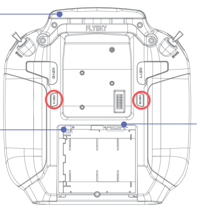](../assets/images/hw/flysky-st16/Back_of_st16.png)

relevant document:[flysky ST16 touch](https://www.jianguoyun.com/p/DfgUegMQys6vDhir-aUGIAA)

- [line link](#line-link)
- [Screen material preparation](#screen-material-preparation)
- [Touchscreen assembly](#touchscreen-assembly)

## line link
Connect as shown in the picture.

[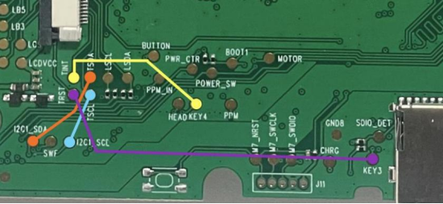](../assets/images/hw/flysky-st16/Contact_connection.png)

I use 0.8mm thick PCB for connection.

[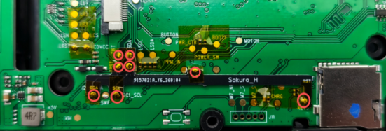](../assets/images/hw/flysky-st16/PCB.png)
## Screen material preparation

Separate the original outer screen from the inner screen

[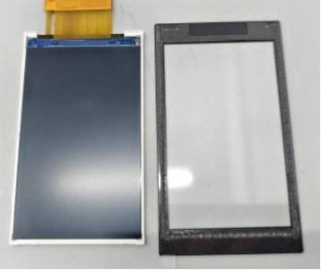](../assets/images/hw/flysky-st16/Screen_separation.png)

Replace with the IC：ft6236U touch external screen.

Product link：[FT6236U touch glass](https://item.taobao.com/item.htm?from=cart&id=627131226350&mi_id=0000tXbR3mX7zBJlOkPorNzXzd14FBHPjWwk2tTlrs-2qR8&skuId=4449085013858&spm=a1z0d.6639537%2F202410.item.d627131226350.2eed7484BfaY5i&upStreamPrice=1800)

Handling the touch glass

Remove the inner protective film and the double-sided adhesive.

[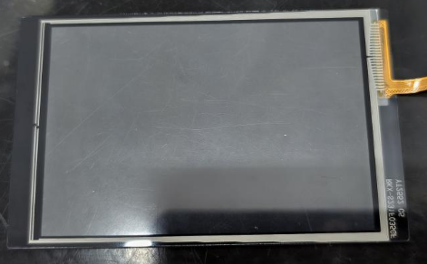](../assets/images/hw/flysky-st16/Touching_the_glass_treatment.png)

Cut off the protruding part of the front protective film and keep the protective film intact.

[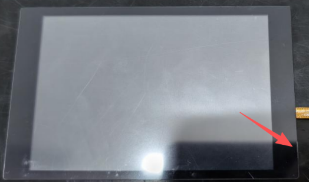](../assets/images/hw/flysky-st16/Touching_the_glass_treatment_2.png)

[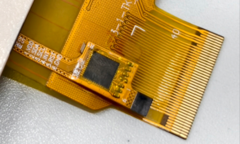](../assets/images/hw/flysky-st16/Wire_connection.png)

Display screen 1-6 pin：
1-GND
2-RST
3-INT
4-SCL
5-SDA
6-VCC
The touch screen is connected to the display's 1-6 pins via 6-pin connector.

Welding 6-pin and 40-pin connectors.

40pin connector, 0.5mm pitch, with the cover attached below

6pin connector, 0.5mm pitch, upper connection

[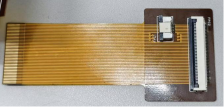](../assets/images/hw/flysky-st16/FPC.png)
## Touchscreen assembly

The materials required for screen assembly

[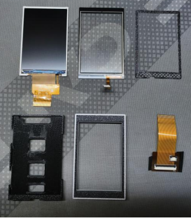](../assets/images/hw/flysky-st16/Screen_assembly_components.png)

Place the inner screen inside the screen frame, and have the wires pass through the gap.

[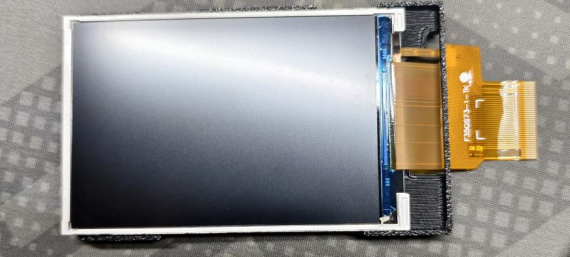](../assets/images/hw/flysky-st16/Screen_installation.png)

Then place the touch glass outside the screen frame, and have the wiring pass through the gap.

[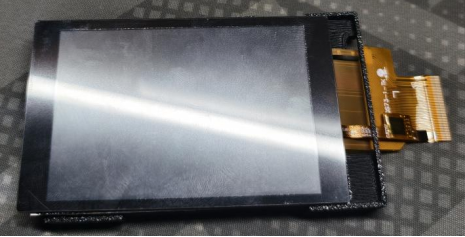](../assets/images/hw/flysky-st16/Touching_glass_installation.png)

As shown in the picture, open the touch glass. Clean the inner screen and the inner side of the touch glass. Put in the TPU gasket.

[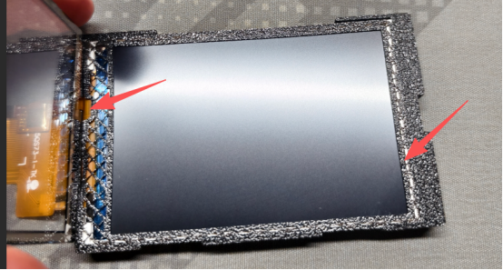](../assets/images/hw/flysky-st16/Install_the_TPU_gasket.png)

Fasten the screen cover plate

[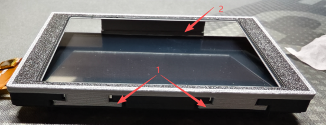](../assets/images/hw/flysky-st16/Top_cover_installation.png)

Connect the 6-pin touch cable to the FPC cable, and then connect the 40-pin cable.

[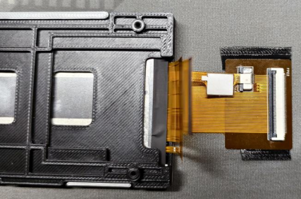](../assets/images/hw/flysky-st16/FPC_connection.png)

Use tape to fix the fpc to the back of the outer frame.

[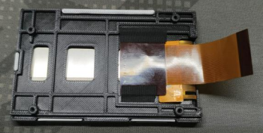](../assets/images/hw/flysky-st16/Placement_of_FPC.png)

Put the screen assembly back into the remote control and insert the screws to connect the wires.

[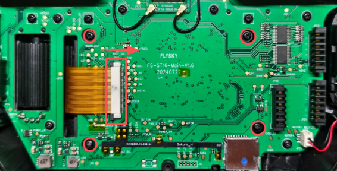](../assets/images/hw/flysky-st16/FPC_connector_module.png)
