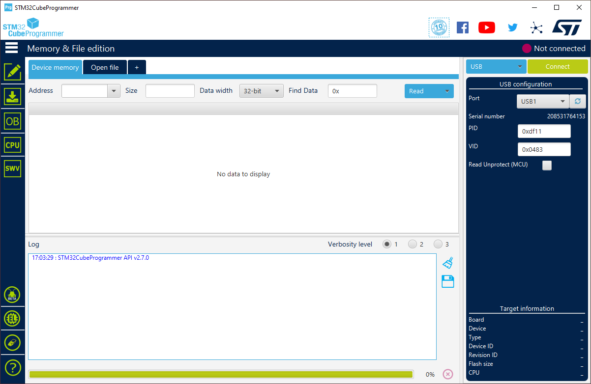
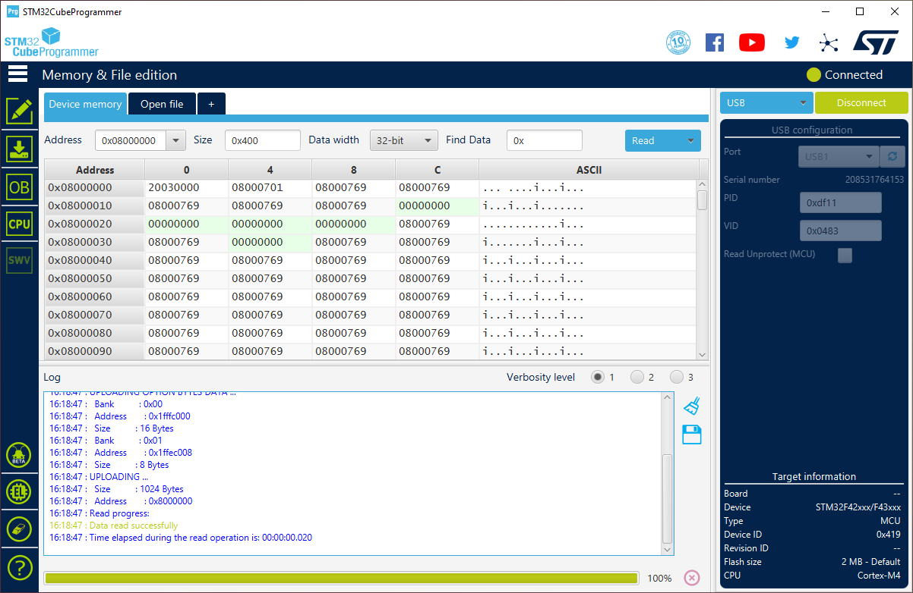
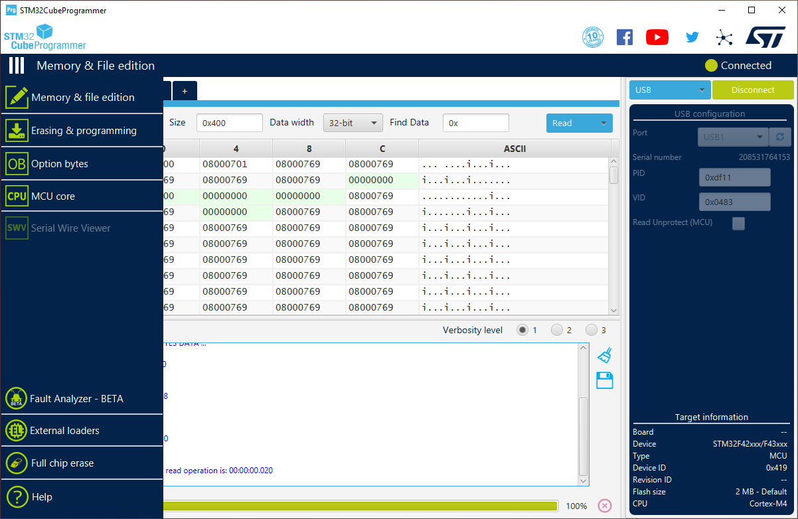
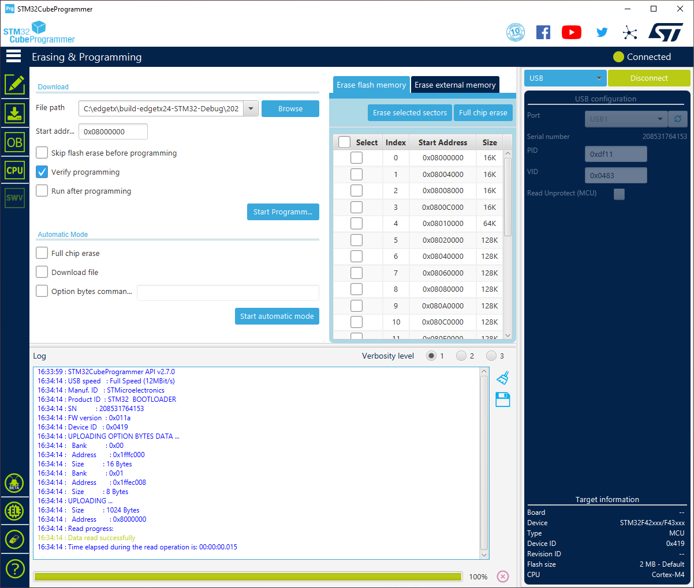
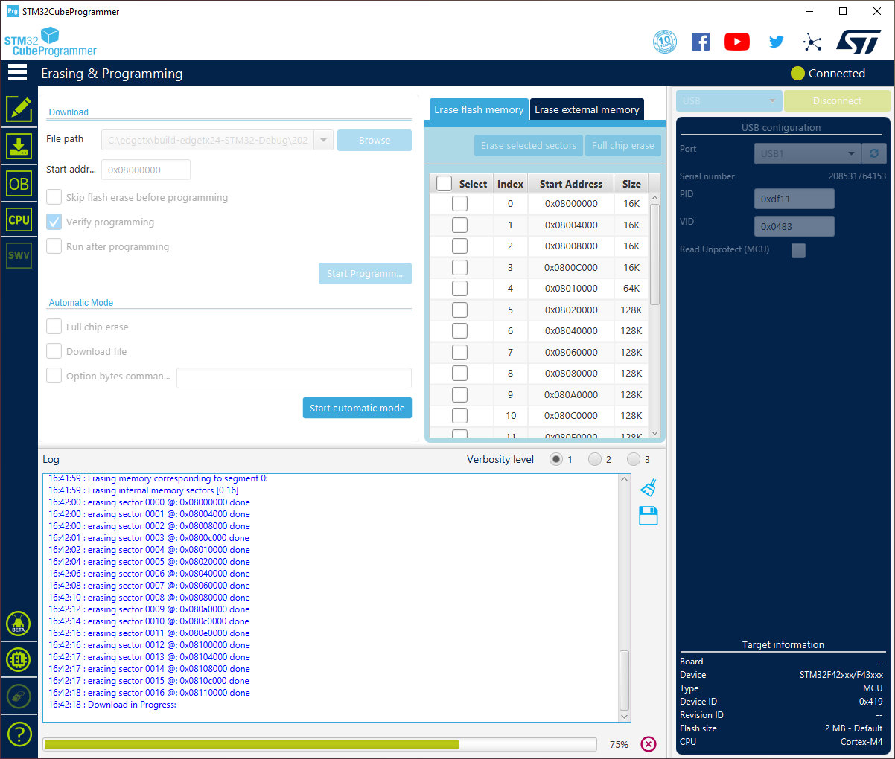
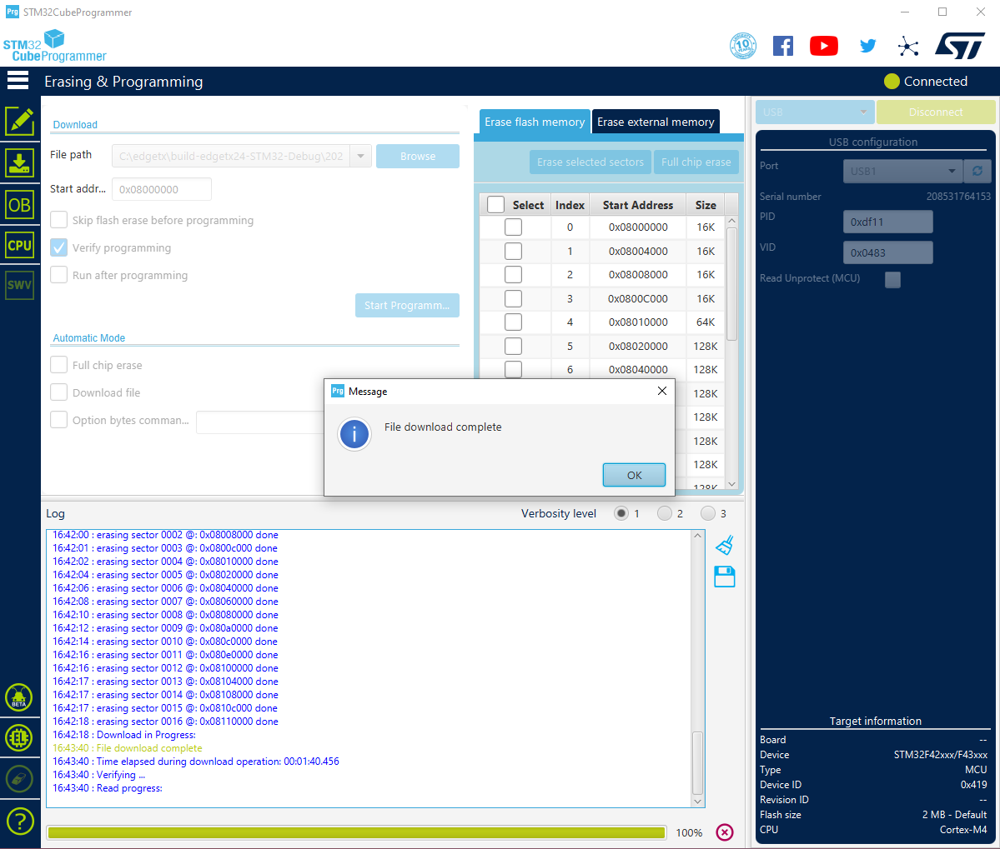
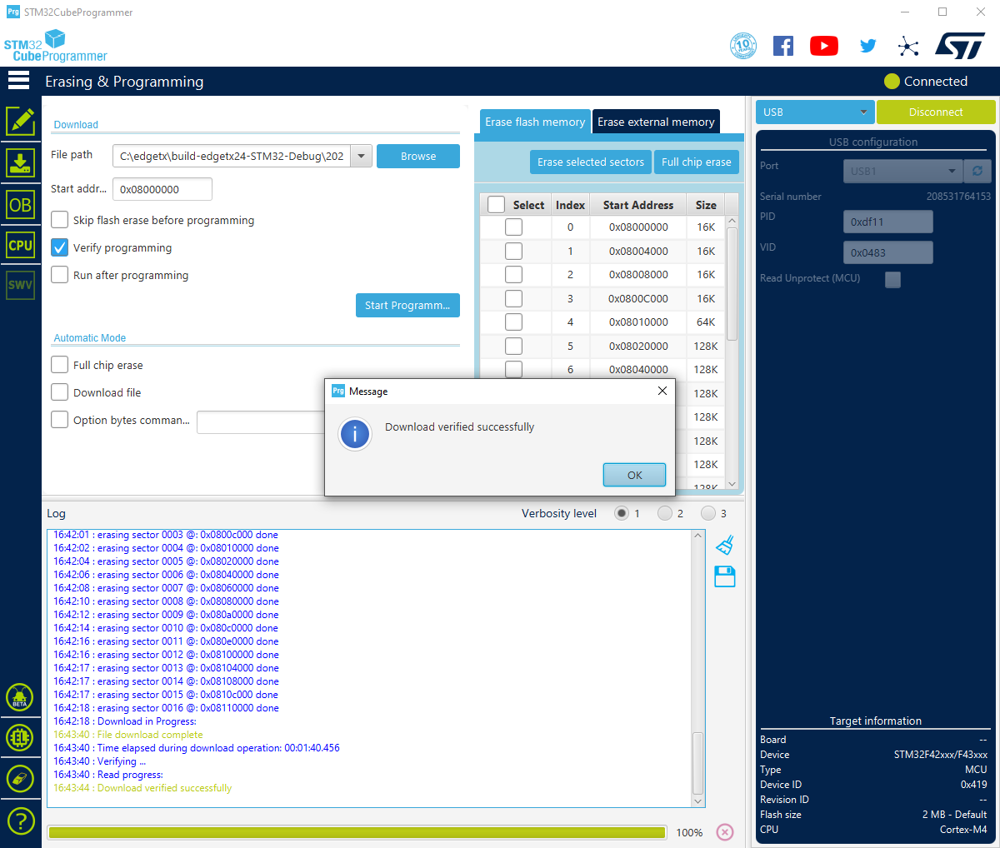

# Unbrick Your Radio

In case you ever need to recover from a bodged flashing, the following steps will lead you back to working radio by cleanly re-flashing the bootloader and the firmware in one go.

John at RCVideoReviews has created a nice video, visually explaining the steps of this page:

1. Download and install a copy of STM32CubeProgrammer, the official flashing tool by ST, the manufacturer of the microcontrollers in EdgeTX radios. Get it here:
[https://www.st.com/en/development-tools/stm32cubeprog.html](https://www.st.com/en/development-tools/stm32cubeprog.html)

During the installation of STM32CubeProgrammer, make sure your radio is not connected to your computer.

The benefit of using STM32CubeProgrammer, instead of numerous other tools, is that it comes with reliably working Device Firmware Upgrade (DFU) drivers, required to perform the recovery of the radio. This has shown to be especially critical on Microsoft Windows operating systems. DFU is a hardware feature of the STM32 chips (the main microcontrollers in EdgeTX radios) that cannot be altered, erased or otherwise tampered with, thus it is always there and will allow you to easily recover from flashing mishaps.

You might be requested to make an account at ST to be able to download STM32CubeProgrammer.

2. Next, grab yourself a correct EdgeTX binary file to flash your radio with. You can use for example [EdgeTX Flasher](https://github.com/EdgeTX/flasher/releases) or directly browse to [EdgeTX GitHub](https://github.com/EdgeTX/edgetx/releases) page to fetch a binary of your choice. Save the binary on your local drive in a location you can easily find it.

3. Connect your radio via USB to your PC while your radio is turned off. In case your radio has multiple USB ports, make sure you are using the data USB port and not the charging port. For example, on popular RadioMaster TX16S, you should use the top USB-C port next to the antenna. Make sure your USB cable is equipped also with data pins. Some more simpler USB cables only have power pins for charging, but the data pins for communication are not wired up. Such cables won't unfortunately work for radio recovery.

4. Start STM32CubeProgrammer. Your radio should be detected on the right side of the screen under `USB configuration` as a `USB` with a number, typically `USB1`. Open the drop-down menu next to `Port` to see if you see `USB1` listed there and can select it. Below is an image how it should look like (you can click on the images to open them bigger):

If the _Port_ drop-down box lists `No DFU`, then please re-check your cabling and try with another USB port on your PC. When reconnecting your radio to the computer, make sure the radio is still turned off.

If you hear a bling sound from your system, when connecting an USB device, such as an USB stick, then the same sound should be emitted, when you connect your radio in DFU mode to your computer.

5. Click the green `Connect` button on top right. You might be greeted with some seemingly random content, do not get alarmed - this is all perfectly fine and just showing some of the first bytes of memory that are currently saved on the microcontroller. Most importantly, the lower right corner should now list under field `CPU` either `Cortex-M3` or `Cortex-M4` (according to your radio):

6. Next we load the EdgeTX binary into STM32CubeProgrammer. For this, first let's open the left menu fully, by clicking the button with three white horizontal bars on top left. After clicking it, the menu should open and the 3 bars become vertical bars:

Click `Erasing & programming` (a green icon, with a down arrow and a flat rectangular shaped device under it).

7. Next, click blue `Browse` button behind _File path_ field and navigate and open the previously downloaded EdgeTX binary for your radio. Leave `Verify programming` selected and make sure `Run after programming` is not selected:

The instructions here ask to uncheck the `Run after programming` in order to avoid a warning dialog that would otherwise pop up at the end of flashing, when the code in the radio's microcontroller starts and the radio abruptly self-disconnects from STM32CubeProgrammer.

8. Click the blue button `Start Programm...` in the middle of the STM32CubeProgrammer.

First you should see some messages about erasing sectors and the green progress bar will go back and forth between left and right. This should be followed by a `Download in Progress` notification with green progress bar at the bottom of the STM32CubeProgrammer growing from left to right:

Especially on bigger color radios with chunky microcontrollers, the flashing can take some minutes. Please be patient and wait for the STM32CubeProgrammer to do it's thing.

9. When flashing has completed, you should be greeted with `File download complete` pop-up:

followed briefly thereafter with `Download verified successfully` pop-up:

In case you are only seeing the latter pop-up, then it is likely just covering the `File download complete` pop-up, that is underneath it. Click `OK` on both pop-ups to dismiss them.

10. Click the green `Disconnect` button on top right of STM32CubeProgrammer.

11. Eject the radio from your operating system, similarly as you would safely disconnect an USB stick (typically the radio is listed in DFU mode as `STM32 BOOTLOADER`).

You can now remove the USB cable from your radio and power it up.

You should be greeted with EdgeTX running on your radio again.

